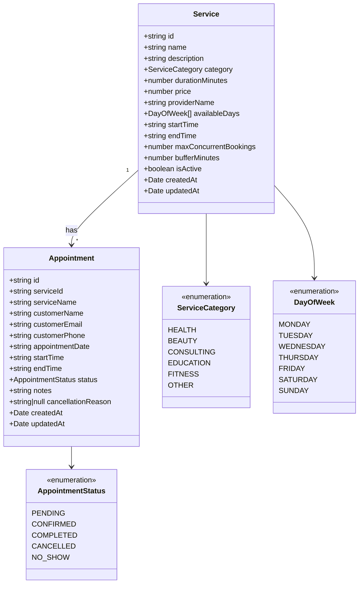

# UML Diagram

เอกสารนี้สรุปโครงสร้างคลาสหลักของระบบ Appointment Booking System ในรูปแบบ Mermaid class diagram

## Notes

- `Service` เป็นข้อมูลตั้งต้นของบริการที่เปิดให้จอง
- `Appointment` อ้างอิง `Service` ผ่าน `serviceId`
- `AppointmentStatus` ใช้ควบคุมการเปลี่ยนสถานะของการนัดหมาย
- `availableDays` ใช้ร่วมกับช่วงเวลาเปิด-ปิดบริการในการคำนวณ slot ที่ว่าง
