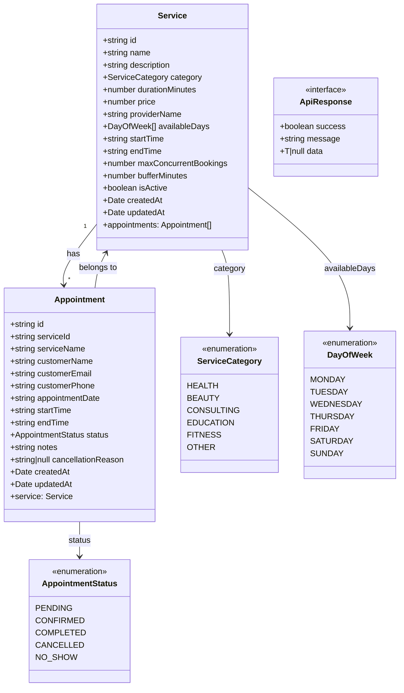
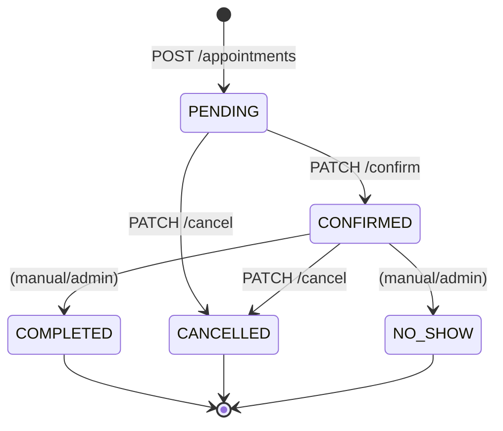

# UML Diagram

เอกสารนี้สรุปโครงสร้างคลาสหลักของระบบ Appointment Booking System ในรูปแบบ Mermaid class diagram

## Class Diagram

## State Diagram — AppointmentStatus

## Notes

- `Service` เป็นข้อมูลตั้งต้นของบริการที่เปิดให้จอง
- `Appointment` อ้างอิง `Service` ผ่าน `serviceId` (ManyToOne) และ `Service` มี `appointments[]` (OneToMany)
- `AppointmentStatus` ใช้ควบคุม workflow — Terminal State (`COMPLETED`, `CANCELLED`, `NO_SHOW`) ไม่สามารถแก้ไขได้อีก
- `availableDays` ใช้ร่วมกับช่วงเวลาเปิด-ปิดบริการในการคำนวณ available slots
- `ApiResponse<T>` เป็น standard response format ที่ทุก endpoint ใช้
